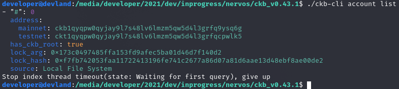
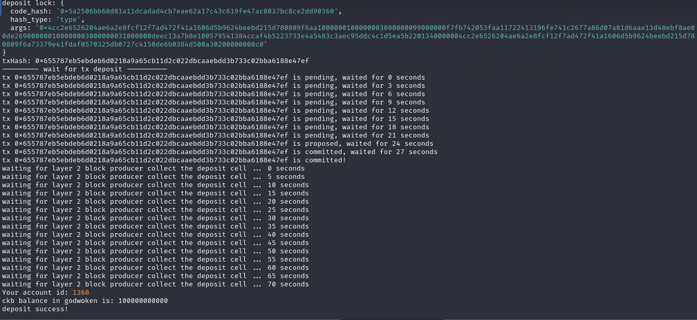

## Gitcoin: 1) Create a Godwoken Account on the EVM Layer 2 Testnet

1) A screenshot of the accounts you created (account list) in ckb-cli.

2) A link to the Layer 1 address you funded on the Testnet Explorer.
https://explorer.nervos.org/aggron/address/ckt1qyqpw0qyjay9l7s48lv6lmzm5qw5d4l3grfqcpwlk5

3) A screenshot of the console output immediately after you have successfully submitted a deposit to Layer 2.

1. Create a Godwoken Account on the EVM Layer 2 Testnet

Nervos supports the use of Ethereum compatible smart contracts which allow developers to create dApps using the popular Solidity smart contract language. This is done by running the EVM (Ethereum Virtual Machine) in a Layer 2 based execution environment using the Godwoken and Polyjuice frameworks.

EVM dApps run nearly identically on Nervos as they do on Ethereum. This, in turn, allows dApp users to continue using the popular MetaMask wallet without having to install anything new. DApp users who are familiar with Ethereum will feel right at home!
Task Instructions

    Note: Before starting the tasks, it is recommended that you review the Task Submission section so you know what materials you will need to provide to judges to review your task submission.

In the first task you'll create a Godwoken account on Nervos' EVM Layer 2 Testnet. Creating a Godwoken account is the first step that all users must perform on Nervos' Layer 1 blockchain before they can begin interacting with EVM smart contracts on Layer 2.

We will be focusing on Layer 2 for these tasks, so you don't need to think about Layer 1 too much right now. Alright, let's start creating an account!

The basic the process of creating a Godwoken account is:

    Create and fund an account with CKBytes on Layer 1.
    Deposit some CKBytes on Layer 2.

1. Create and Fund an Account with CKBytes on Layer 1

In this first step you must create an account on the Testnet Nervos CKB Layer 1 blockchain, fund it with some CKBytes, then export the private key for the account so it can be provided to other scripts.

This can be accomplished easily using the ckb-cli command line tool that is included with the CKB Node software. Free Testnet CKBytes can be obtained by using the Nervos Faucet.

For instructions on completing this step, please follow the steps in this 
[tutorial](https://github.com/Kuzirashi/gw-gitcoin-instruction/tree/master/src/component-tutorials/1.setup.account.in.ckb.cli.md).

2. Deposit some CKBytes on Layer 2

In this step you must make a deposit of CKBytes from Layer 1 to the Layer 2 which is provided by Godwoken. This step is necessary for Godwoken to create the user's Layer 2 account.

On Nervos, the user is responsible for paying state rent for any on-chain data they use, and this is done by requiring the user to lock 1 CKByte for every byte of data that needs to be stored on-chain. This is different from Ethereum, where state rent is still in the planning phases and has not been implemented yet. This deposit is used by Godwoken to lock CKBytes to pay the required state rent. For a more detail explanation about the tokenomics of Nervos, we recommended you view the Crypto-Economics Whitepaper.

This deposit can be made using the example script code provided in the tutorial below. Make sure you have your private key from the previous step available since it will be needed by the example script.

For instructions on completing this step, please follow the steps in this [tutorial](https://github.com/Kuzirashi/gw-gitcoin-instruction/tree/master/src/component-tutorials/4.layer2.deposit.md).