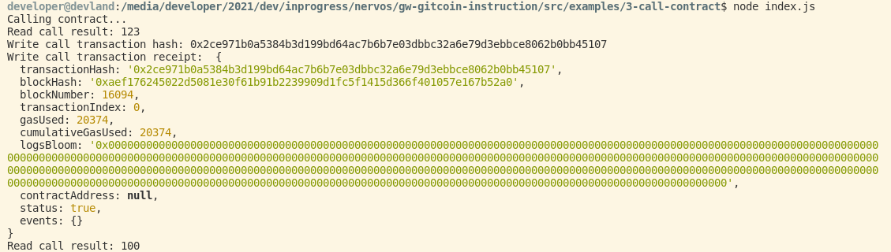

## Gitcoin: 3)  Issue a Smart Contract Call to the Deployed Smart Contract

1) A screenshot of the console output immediately after you have successfully issued a smart contract call.

   

2) The transaction hash from the console output (in text format).
   transactionHash: '0x2ce971b0a5384b3d199bd64ac7b6b7e03dbbc32a6e79d3ebbce8062b0bb45107'  
    
3) The contract address that you called (in text format).

    Contract Address: 0x2238066dF2525a431C9170Fd99Efe4243BD52Aa6

4) The ABI for contract you made a call on (in text format).

         [
        {
        "inputs": [],
        "stateMutability": "payable",
        "type": "constructor"
        },
        {
        "inputs": [
          {
            "internalType": "uint256",
            "name": "x",
            "type": "uint256"
          }
        ],
        "name": "set",
        "outputs": [],
        "stateMutability": "payable",
        "type": "function"
        },
        {
        "inputs": [],
        "name": "get",
        "outputs": [
          {
            "internalType": "uint256",
            "name": "",
            "type": "uint256"
          }
        ],
        "stateMutability": "view",
        "type": "function"
        }
        ]

Issue a Smart Contract Call to the Deployed Smart Contract

In this task we will learn how to make function calls to the smart contract that was deployed in the previous task. We will provide some simple example code that uses the popular Web3.js library to do so. This code will allow you to interact with your smart contract which is running on Nervos' Layer 2 in a nearly identical way to if it was running on Ethereum.

    Note: You are free to use a different smart contract than is included with the instructions, but your smart contract include at least one function to read a value, and at least one function to write a value.

Your smart contract should operate just like it would on Ethereum, but in actuality, it will be running in an EVM environment provided by Polyjuice. When combined with Godwoken, which provides a Layer 2 solution with optimistic rollups, total throughput performance is significantly higher. This means that all users will experience dramatically lower fees, and more reliable transaction confirmation than if they were using Ethereum.
Task Instructions

    Note: Before starting the tasks, it is recommended that you review the Task Submission section so you know what materials you will need to provide to judges to review your task submission.

Prerequisites

Before you begin on this task you must complete the first and second tasks. If you have not completed them, please do so now.

You will need the private key from the Ethereum address that you used in the previous task. Make sure this is Ethereum private key for Layer 2, not the private key from your Nervos CKB Layer 1 address. If you do not have this, you can follow the instructions in this tutorial, to extract your private key from MetaMask.

This task requires the Gitcoin Task Instruction Examples repo (gw-gitcoin-instruction) which was setup in task 2. If you do not have this repo available for any reason, please set it up now.
1. Prepare the Smart Contract Address and ABI

In order to execute a function call on a smart contract, it must be deployed, and you must have the ABI that was generated when the code was originally compiled. "ABI" stands for Application Binary Interface, and it contains the information required by an application to interface and call functions on the smart contract.

In the previous task, you compiled and deployed an Ethereum smart contract. You may be able to reuse that smart contract for this task. If it is no longer available, please revisit the previous task and complete it again.

The example smart contract from the previous task is SimpleStorage.sol, and the corresponding ABI value can be found in 2-deploy-contract/build/contracts/SimpleStorage.json after the contract is compiled. Below is the ABI value which has been extracted from this file.

[
    {
      "inputs": [],
      "stateMutability": "payable",
      "type": "constructor"
    },
    {
      "inputs": [
        {
          "internalType": "uint256",
          "name": "x",
          "type": "uint256"
        }
      ],
      "name": "set",
      "outputs": [],
      "stateMutability": "payable",
      "type": "function"
    },
    {
      "inputs": [],
      "name": "get",
      "outputs": [
        {
          "internalType": "uint256",
          "name": "",
          "type": "uint256"
        }
      ],
      "stateMutability": "view",
      "type": "function"
    }
]

The SimpleStorage contract has also been deployed to Testnet at the address below. You can optionally use this for testing purposes, but the judges will require you to use your own contract to complete this task.

0xC46e27169824290EcaEf6E14503C1a6DE72d41B0

2. Prepare and Run the Example Code to Call the Smart Contract

Next we will use the example code to make a function call in your smart contract. Open the file gw-gitcoin-instruction/src/examples/3-call-contract/index.js in an editor of your choosing, and find the readCall() and writeCall() functions.

The function readCall() will read a value from the smart contract without a state change. This does not require a transaction because no data is changing. The writeCall() function will write a new value to your smart contract. A transaction will be required because state changes can only occur through transactions. This behavior is the same as on the Ethereum chain.

Next, you need to update the values in index.js to match your private keys and smart contract.
Private Key

The first thing you will need to do is update index.js with your Ethereum private key. This private key will be used to make the function calls, and it should be the same Ethereum private key that funds were added to in the previous tasks. Make sure you use your Ethereum private key for Layer 2, not your Nervos CKB Layer 1 private key. Replace <YOUR_ETHEREUM_PRIVATE_KEY> with this value.

const ACCOUNT_PRIVATE_KEY = '<YOUR_ETHEREUM_PRIVATE_KEY>';

ABI

Next, add your contract ABI to the script by replacing <YOUR_CONTRACT_ABI> with the ABI value from the JSON file which was generated during compilation.

    Note: The CONTRACT_ABI constant is expecting an array with your ABI as index 0. Make sure this is a data structure, just like it is in SimpleStorage.json, and does not get input as a string.

const CONTRACT_ABI = [<YOUR_CONTRACT_ABI>]; // Array

Contract Address

Replace <YOUR_CONTRACT_ADDRESS> with the address of the Ethereum contract you will be making calls to. This value should be a hex string that was returned when the after deploying the contract.

const CONTRACT_ADDRESS = '<YOUR_CONTRACT_ADDRESS>';

Replace the Read Function Name

Locate <YOUR_READ_FUNCTION_NAME> within the readCall() function. This must be replaced with function name from your contract that is used for reading.

const callResult = await contract.methods.<YOUR_READ_FUNCTION_NAME>().call({
  from: account.address
});

Replace the Write Function Name

Locate <YOUR_WRITE_FUNCTION_NAME> within the writeCall() function. This must be replaced with function name from your contract that is used for writing.

const callResult = await contract.methods.<YOUR_WRITE_FUNCTION_NAME>().call({
  from: account.address,
  gas: 6000000,
  gasPrice: '0'
});

Run the Script

After all values have been replaced, use the following commands in a console to execute the script.

cd ~/projects/gw-gitcoin-instruction/src/examples/3-call-contract
node index.js
