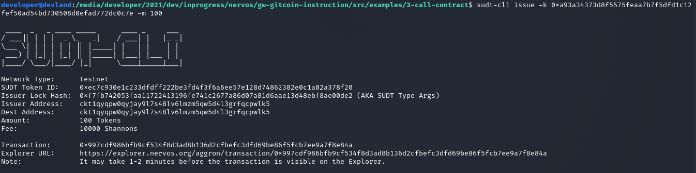
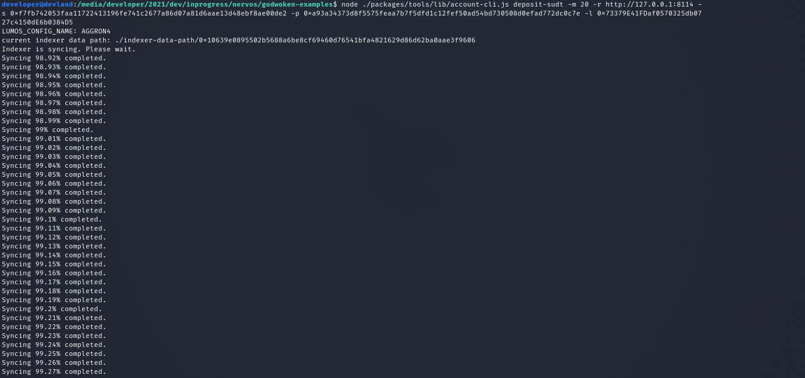
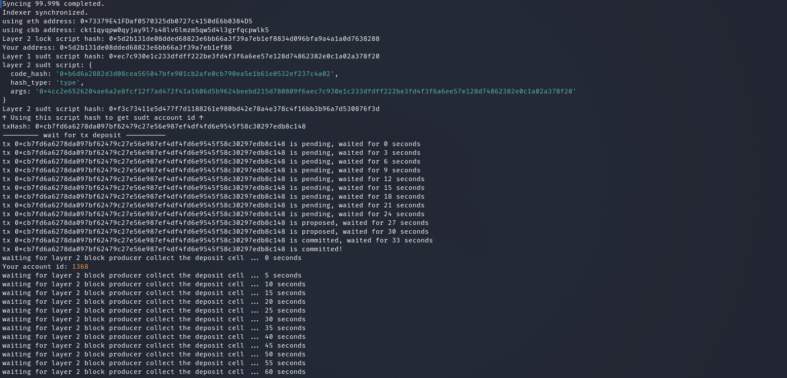
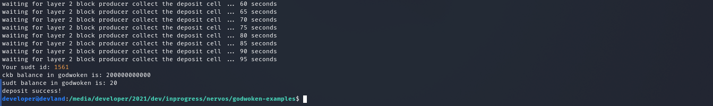

## Gitcoin: 4)  Issue an SUDT Token on Layer 1 and Deposit it to Layer 2

1) A link to the Layer 1 address you funded on the Testnet Explorer.
https://explorer.nervos.org/aggron/address/ckt1qyqpw0qyjay9l7s48lv6lmzm5qw5d4l3grfqcpwlk5

2) A screenshot of the console output immediately after using sudt-cli to create your SUDT tokens on Layer 1.

3) A link to the transaction ID created by sudt-cli on the Testnet Explorer.
https://explorer.nervos.org/aggron/transaction/0x997cdf986bfb9cf534f8d3ad8b136d2cfbefc3dfd69be86f5fcb7ee9a7f8e84a

4) A screenshot of the console output immediately after you have successfully submitted a deposit to Layer 2 using the account-cli tool.

5)The SUDT ID from the console output after executing the deposit script (in text format).
Your sudt id: 1561

 
 

#### Issue an SUDT Token on Layer 1 and Deposit it to Layer 2

In this task, we create a token on Layer 1, then move it to the EVM compatible Layer 2. The token on Layer 1 will use the SUDT standard, which is the most basic form of asset on Nervos. When the token is moved to Layer 2, it is exchanged for an ERC20 token, which is the most popular token standard on blockchains that support the Ethereum Virtual Machine (EVM).

The reason that ERC20 tokens are used on Layer 2 is that this ensures full compatibility with EVM smart contracts. Existing smart contracts that are designed to use ERC20 tokens will continue to work without modification. Because the EVM Layer 2 is based on optimistic rollups, any dApp built on Nervos will immediately gain higher TPS with dramatically lower fees for all their users.

In the future, support for other blockchains, such as Cardano, Polkadot, and Stellar, can be added. This enables Nervos to support smart contracts from virtually any platform, and all of their respective token standards. All tokens based on any standard will be able to freely move between layers and different execution environments, enabling asset transfer functionality that was previously difficult to impossible on many other platforms.
Task Instructions

    Note: Before starting the tasks, it is recommended that you review the Task Submission section so you know what materials you will need to provide to judges to review your task submission.

We will start by issuing an SUDT token on Layer 1. To do this, you will need the private key of a Layer 1 account that has been funded with Testnet CKBytes. You should already have this available from the previous tasks. After you have a funded account, you can use the sudt-cli tool to create an SUDT token on the Layer 1 Testnet.

    Note: Your private keys are used to secure your accounts and all the funds and assets contained within. It is important to keep your private keys safe, and to only use them with tools you can trust. However, on these tasks we will only be working with Testnet funds and assets that have no value. You can operate without concern knowing that there is nothing at risk.

1. Setup a Layer 1 Account With Funds

The first step is to setup an account with Testnet funds. You can reuse an existing account if you completed this in previous tasks. If you don't have one, you can complete the steps in this tutorial to do so.

After your account is setup and funded, keep track of your private key and corresponding Testnet address. You will be able to use these with the sudt-cli tool to issue a token on Nervos' Layer 1!
2. Use the sudt-cli Tool to Issue an SUDT Token on Layer 1

The next step is to create an SUDT token on Nervos' Layer 1. This can be done using the sudt-cli command line tool. This tool with use your private key to access the funds on the corresponding account to create the SUDT tokens.

You can follow the instructions in this tutorial to use sudt-cli to issue and SUDT Token on the Testnet using your Layer 1 private key.
3. Setup the Godwoken Examples Tool Package

The next step is to clone the Godwoken Examples tool package and prepare it for use. This tool package contains the code we will need to interact with Godwoken.

You can follow the instructions in this tutorial to setup the Godwoken Examples tool package.
4. Deposit Layer 1 SUDT Tokens to on Layer 2

To deposit your SUDT tokens to Layer 2, you will need to execute the following command in godwoken-examples directory. Replace the <VARIABLES> in the command template below with the values matching your account and node information.

node ./packages/tools/lib/account-cli.js deposit-sudt -m 20 -r <INSERT_TESTNET_RPC_URL> -s <INSERT_SUDT_ISSUER_LOCK_HASH> -p <INSERT_PRIVATE_KEY> -l <INSERT_ETH_ADDRESS>

Variable Description:

    <INSERT_TESTNET_RPC_URL> - The RPC URL of the Testnet CKB node you will use.You can setup your own local Testnet node, or you can use any public node.
    Nervos Foundation Public Testnet CKB Node: http://3.235.223.161:18114
    <INSERT_SUDT_ISSUER_LOCK_HASH> - This is the Issuer Lock Hash value from SUDT-CLI tool, which is visible after you issue tokens or check the balance. This is the same value as the "SUDT Type Script Args", which you may also see depending on the version of SUDT-CLI you use. If you're unsure how to get it please revisit the Issue SUDT using command-line interface tutorial.
    <INSERT_PRIVATE_KEY> - This is the private key to your Nervos Layer 1 account. The instructions how to get it are in step 1 of this tutorial.
    <INSERT_ETH_ADDRESS> - The Ethereum address of your account from MetaMask. This will be used to receive funds on Layer 2. This can be found in MetaMask by clicking the address within the wallet as seen below.

MetaMask Screenshot (click to expand)

Example final command with all values filled in:

node ./packages/tools/lib/account-cli.js deposit-sudt -m 20 -r http://3.235.223.161:18114 -s 0x5c7253696786b9eddd34e4f6b6e478ec5742bd36569ec60c1d0487480ba4f9e3 -p 0x79682c20bbcaf7fcf18eb0c69b133c872227ceb88971090e7f2242c80cd54d18 -l 0xD173313A51f8fc37BcF67569b463abd89d81844f

    Note: The 'account-cli' tool will need to sync with Testnet on the first usage. This can sometimes take several hours, but there are ways to speed this up. Look at the instructions in this tutorial to speed it up using snapshot data.

Example Output (click to expand)

Congratulations! You've just deposited your Layer 1 SUDT tokens to your Ethereum-compatible Layer 2 account as ERC20 tokens!
Potential Errors and Solutions

    If you get the error: "Not enough capacity in from infos!" then it means your account on Layer 1 (that you passed access to via private key) doesn't have enough funds to perform an operation.
    If you get the error: "Not enough amount in from infos!" then it means you either didn't issue tokens on Layer 1 before running this command, or you've issued less than you want to deposit to Layer 2 now.
